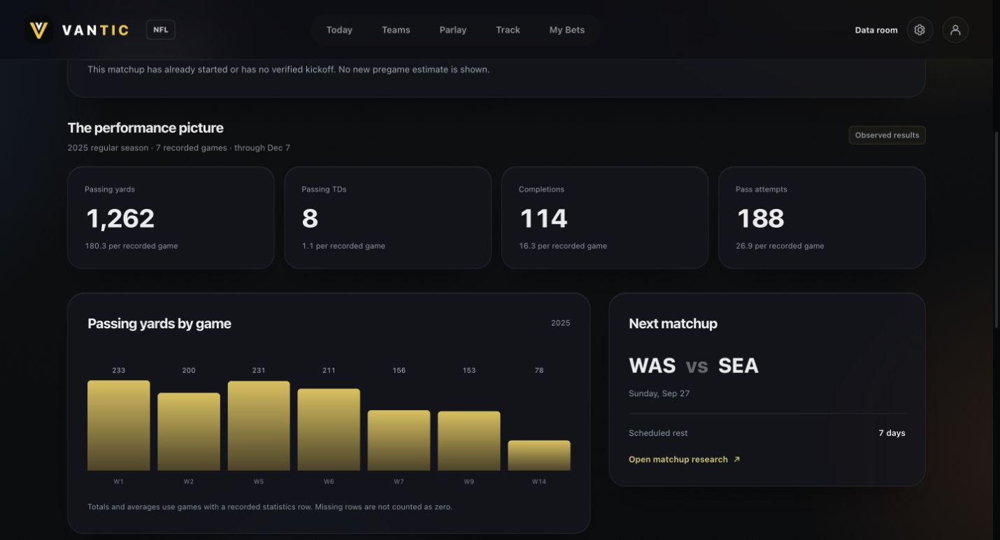
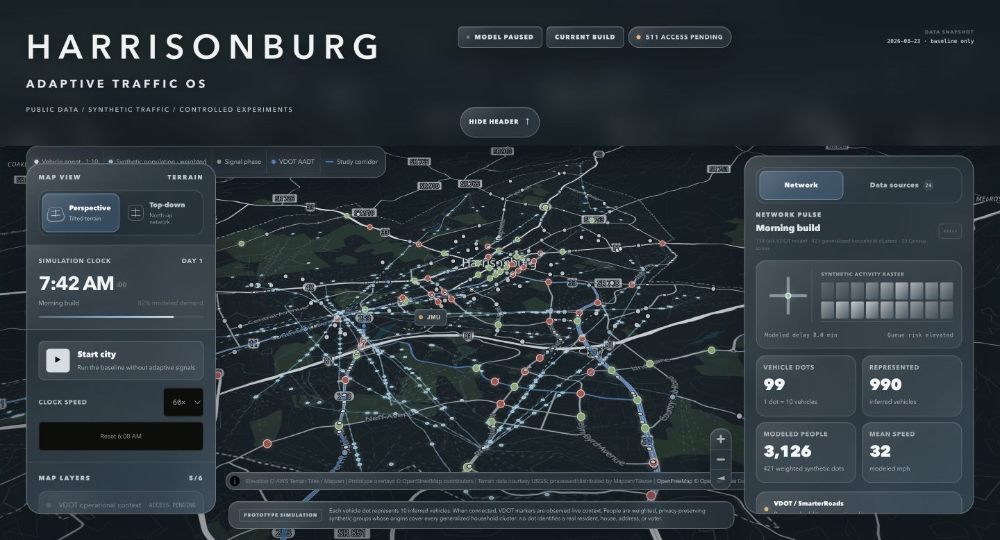
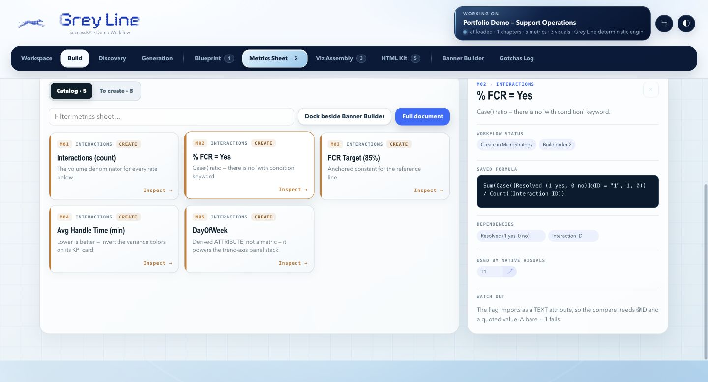
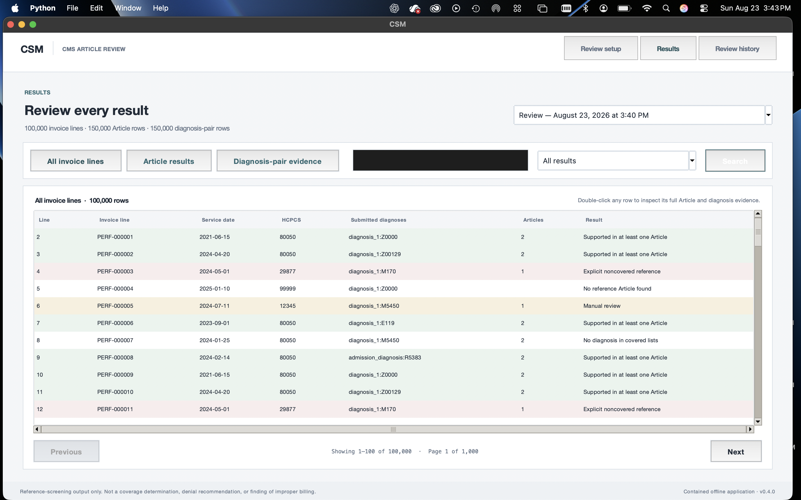

# Nathaniel Mareano

I'm a Computer Information Systems student at James Madison University, graduating in May 2027. I like taking an unfamiliar problem, connecting the right data, and building something people can actually use.

My work spans software development, analytics, solutions consulting, and public-sector technology. I'm interested in early-career opportunities in product engineering, data systems, and customer-facing technical work.

[Portfolio](https://nathanielmareano.com) · [LinkedIn](https://www.linkedin.com/in/nathaniel-mareano-44a06a21a)

## Selected work

Each project links to a short walkthrough of the problem, my contribution, technical decisions, and current status. These are actual application screenshots; the demonstrations use public or synthetic data.

| Project | Preview | What I built |
| --- | --- | --- |
| **[Vantic](projects/vantic.md)** Sports research |  | A React and FastAPI research prototype with traceable statistics, source metadata, and validated data snapshots. A parallel SwiftUI app is also in development. |
| **[Harrisonburg OS](projects/harrisonburg-os.md)** City data and simulation |  | An interactive map combining public geography, traffic-volume records, and aggregate population inputs with a synthetic movement model. |
| **[Greyline](projects/greyline.md)** Dashboard planning |  | A dashboard preparation workspace and Python MCP tools built during my solutions-consulting internship and adopted by the Solutions team. |
| **[CSM](projects/csm.md)** Offline reference review |  | A Python desktop prototype that organizes invoice-reference comparisons, preserves supporting evidence, and keeps review history locally. |

## How I work

I care about clear requirements, inspectable data, usable interfaces, and a handoff someone else can understand. I use Claude Code and Codex to support development while owning the architecture, analytical logic, validation, and final decisions.

**Tools I work with:** Python, JavaScript/TypeScript, React, FastAPI, SwiftUI, SQL, SQLite, and MCP.

This repository contains project overviews and selected screenshots. The implementation repositories remain private. More screenshots and walkthroughs are available on my [portfolio](https://nathanielmareano.com).
